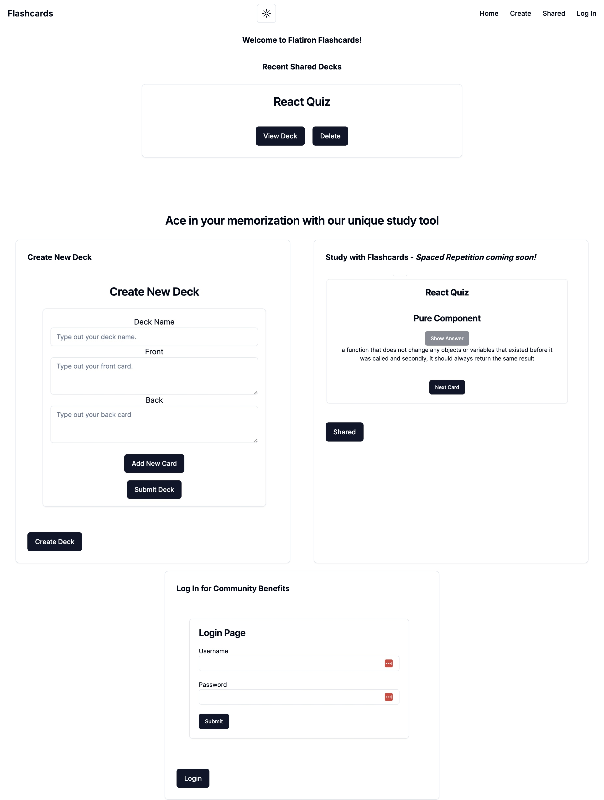

# Flatiron Flashcards



## Description

Flatiron Flashcards is a web application developed as a Phase 2 project for the Flatiron School Full Stack Software Engineering Bootcamp. This app allows users to create, manage, and study flashcards, with features for both personal and shared decks.

## Features

- Create and manage flashcard decks
- Study flashcards with a simple interface
- Share decks with other users
- Mock User authentication system
- Responsive design for various screen sizes

## Technologies Used

- React
- Next.js
- TypeScript
- Tailwind CSS
- Shadcn UI Components
- JSON Server (for mock backend)

## Getting Started

### Prerequisites

- Node.js (v14 or later)
- npm or yarn

### Installation

1. Clone the repository:

   ```
   git clone https://github.com/your-username/flatiron-flashcards.git
   ```

2. Navigate to the project directory:

   ```
   cd flatiron-flashcards
   ```

3. Install dependencies:

   ```
   npm install
   ```

4. Start the development server:

   ```
   npm run dev
   ```

5. Open [http://localhost:3000](http://localhost:3000) in your browser to see the application.

### Running the Backend

This project uses a JSON server for the backend (https://github.com/jouyang19/Flatiron-Flashcards-json-server). To start it:

1. Open a new terminal window
2. Navigate to the backend directory
3. Run the following command:
   ```
   npm run dev
   ```

## Usage

- Create an account or log in
- Browse shared decks on the home page
- Create your own decks in the "Create" section
- Study flashcards by clicking on a deck
- Manage your decks in the user dashboard

## Future Enhancements

- Implement spaced repetition using the FSRS library
- Add more interactive study modes
- Improve user statistics and progress tracking

## Acknowledgments

- Flatiron School for the project opportunity
- The open-source community for the amazing tools and libraries used in this project
